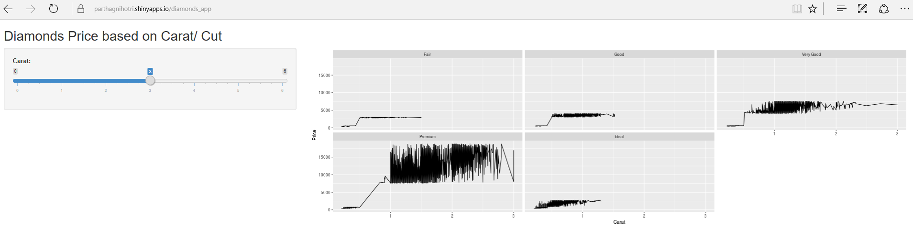

Shiny Application: Diamonds Price based on Carat/ Cut
========================================================
author: Parth Agnihotri
date: 10 Aug 2017
autosize: true

Diamonds Price based on Carat/ Cut
========================================================

Application Details:

This application provides interface to check Price Data
based on Carat and Cut.

- Input: User can select the value for Carat on the left
side slider bar.
- Output: Right side plot area would plot price based on
the input carat value. Seperate plots would be printed
for each of the cut types.


Diamonds Data - Structure
========================================================

- Application uses carat, price and cut columns from the
dataset.


```r
library(ggplot2)
head(diamonds)
```

```
# A tibble: 6 x 10
  carat       cut color clarity depth table price     x     y     z
  <dbl>     <ord> <ord>   <ord> <dbl> <dbl> <int> <dbl> <dbl> <dbl>
1  0.23     Ideal     E     SI2  61.5    55   326  3.95  3.98  2.43
2  0.21   Premium     E     SI1  59.8    61   326  3.89  3.84  2.31
3  0.23      Good     E     VS1  56.9    65   327  4.05  4.07  2.31
4  0.29   Premium     I     VS2  62.4    58   334  4.20  4.23  2.63
5  0.31      Good     J     SI2  63.3    58   335  4.34  4.35  2.75
6  0.24 Very Good     J    VVS2  62.8    57   336  3.94  3.96  2.48
```

Application - ui code
========================================================

```r
# This is the user-interface definition of a Shiny web application
# which plots Diamonds Price based on the Carat and Cut. 
library(shiny)
library(ggplot2)

# Define UI for application that draws Diamonds Price Plot
shinyUI(fluidPage(
   # Application title
  titlePanel("Diamonds Price based on Carat/ Cut"),
   # Sidebar with a slider input for carat
  sidebarLayout(
    sidebarPanel(
       sliderInput("carat","Carat:",
                   min = 0,max = 6,value = 3)),
    
    # Show a plot of the Price 
    mainPanel(plotOutput("plot")))
))
```

Application - Server code
========================================================

```r
# This is the server logic of a Shiny web application which
# filters Diamonds data based on input carat and creates
# price plot based on carat and cut.
library(shiny)
library(ggplot2)
library(dplyr)
# Define server logic required to draw Price Plot
shinyServer(function(input, output) {
  output$plot <- renderPlot({
    # Filter diamonds data based on the carat input
    d <- diamonds %>% filter(carat <= input$carat)
    # draw the plot 
    p <- ggplot(d, aes(d$carat, d$price))
    p <- p + geom_line()
    p <- p +  xlab("Carat") + ylab("Price")
    p <- p + facet_wrap(~cut)
    print(p)
  })
})
```


Application URL 
====================================
Application can be accessed at http://parthagnihotri.shinyapps.io/diamonds_app/


